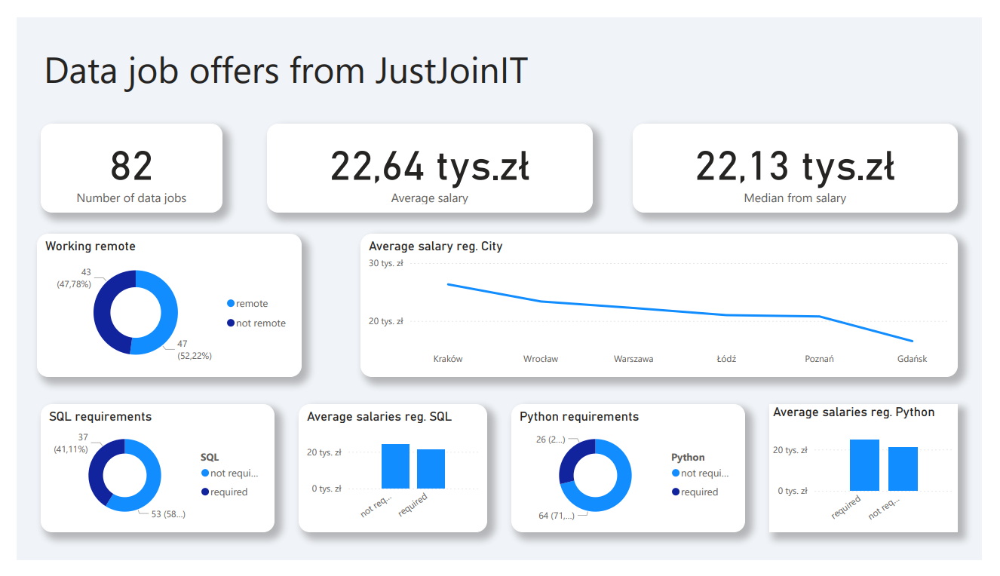

# Project-2: WebScraping & PowerBI Project
In this project, I scraped job listings from the JustJoinIT website, focusing on the data sector. After collecting the data, I cleaned it and visualized it in Power BI.

Web Scraping
To obtain the source code, I used Selenium, and for scraping, I used BeautifulSoup. I created an executable file (.exe) that ran continuously throughout the day, waiting about 10 minutes for the site to refresh, and managed to scrape over 1,000 records. Unfortunately, after removing duplicates, the number of unique records dropped to 90. In hindsight, I should have scraped the entire site rather than focusing solely on the data sector to collect more records.

My code operates in a loop, pausing for 10 minutes to allow the site to refresh before scraping again.

Data Cleaning and Visualization
I used pandas to clean the data. After cleaning, I converted the CSV file to an Excel format and loaded it into Power BI to create visualizations.

Attention!
My code includes an option to filter out job listings that require skills we don't possess. To disable this feature, simply comment out lines 15 and 16 in the code, and uncomment line 17.

Additional Resources
Below, I have included a screenshot of the Power BI dashboard, as well as a PDF file of the report.

